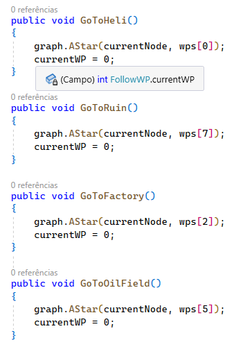

# Waypoints and graph [EN]

## Artificial Intelligence (AI)

The project has an AI that uses the A* algorithm to find the most efficient way for non-player characters (NPCs) to move around the environment.

### Algorithm A*

The A* algorithm is a path search algorithm used to find the shortest path between a starting point and a destination point in a weighted graph. It is widely used in games to simulate intelligent NPC movement, character routing, and more.

In the project I implemented the A* algorithm in a graph to allow the vehicle to move intelligently through the scenery and find the most efficient path to reach its destinations.

## Learning and evolution during the project
### Using Private Methods in Unity

In this project, I learned to use private instead of public methods in Unity to improve code encapsulation and security.

#### Initial approach

#### Final project

   
   

Main benefits of using private methods:

- Encapsulation of functionalities: when defining methods as private, we restrict their access only to the class in which they are defined. This helps organize the code, hiding unnecessary implementation details and preventing other scripts from accessing methods that shouldn't be called externally.
- Protection against unwanted modifications: by making a method private, we guarantee that it can only be called within the class in which it is defined. This prevents other developers from modifying or overriding a method's behavior without fully understanding its dependencies and implications.
- Improved security and stability: the use of private methods helps to reduce the exposure of sensitive parts of the code, protecting it against unauthorized access and possible functionality breaks.

Throughout this project, I've refactored existing code, replacing public methods with private methods whenever possible. This approach improved the structure of the code, making it more modular, readable, and less prone to errors.

### Using Delegates

The project makes use of delegates in the Observer pattern to decouple the code and allow efficient communication between components.

Delegates are data types that allow referencing and calling methods with specific signatures. In the case of this project, delegates were used to handle events related to the sound effects (SFX) and visual effects (VFX) of the game.

Two delegates were defined: `TankMoving` and `TankStopped`. The `TankMoving` delegate fires when the tank is moving, while the `TankStopped` delegate fires when the tank has stopped moving.

These delegates are used to notify other game components of tank actions, such as playing movement sounds or displaying dust particles. By using delegates, the code is decoupled and allows different parts of the project to respond to events independently, making it more flexible and easier to maintain.

This delegate-based approach helps promote a scalable and modular architecture, allowing new components to be added and removed without directly changing existing code.

## Running the project in the browser
[Project on itch.io](https://lordfrazao.itch.io/ai-with-graph)

## How to Run the Game Locally

1. Clone this repository on your local machine.
2. Open the project folder in Unity.
3. Make the necessary settings (if any) and compile the project for the desired platform.
4. Run the game from the Unity development environment or open the build file in your browser.

## Credits

- Thanks to Dr. Penny de Byl for the teachings in her Artificial Intelligence course.

## License

- MIT License

 

 

# Ponto de referência e grafo [PT-BR]

## Inteligência Artificial (IA)

O projeto possui uma IA que utiliza o algoritmo A* para encontrar o caminho mais eficiente para os personagens não jogáveis (NPCs) se movimentarem pelo ambiente.

### Algoritmo A*

O algoritmo A* é um algoritmo de busca de caminho usado para encontrar o caminho mais curto entre um ponto de partida e um ponto de destino em um grafo ponderado. Ele é amplamente utilizado em jogos para simular o movimento inteligente de NPCs, roteamento de personagens e muito mais.

No projeto implementei o algoritmo A* em um grafo para permitir que o veículo se mova de forma inteligente pelo cenário e encontre o caminho mais eficiente para alcançar seus destinos.

## Aprendizado e evolução durante o projeto
### Utilização de Métodos Privados na Unity

Neste projeto, aprendi a utilizar métodos privados ao invés de públicos na Unity para melhorar a encapsulação e a segurança do código.

#### Abordagem inicial

#### Projeto final

  
  

Principais benefícios da utilização de métodos privados:

- Encapsulação de funcionalidades: ao definir métodos como privados, restringimos seu acesso somente à classe em que estão definidos. Isso ajuda a organizar o código, ocultando detalhes de implementação desnecessários e evitando que outros scripts acessem métodos que não deveriam ser chamados externamente.
- Proteção contra modificações indesejadas: ao tornar um método privado, garantimos que ele só possa ser chamado dentro da classe em que está definido. Isso evita que outros desenvolvedores modifiquem ou sobrescrevam o comportamento de um método sem entender completamente suas dependências e implicações.
- Melhoria da segurança e estabilidade: a utilização de métodos privados ajuda a reduzir a exposição de partes sensíveis do código, protegendo-o contra acesso não autorizado e possíveis quebras de funcionalidade.

Ao longo deste projeto, refatorei o código existente, substituindo métodos públicos por métodos privados sempre que possível. Essa abordagem melhorou a estrutura do código, tornando-o mais modular, legível e menos propenso a erros.

### Uso de Delegates

O projeto faz uso de delegates no padrão Observer para desacoplar o código e permitir uma comunicação eficiente entre os componentes. 

Os delegates são tipos de dados que permitem referenciar e chamar métodos com assinaturas específicas. No caso deste projeto, foram utilizados delegates para lidar com eventos relacionados aos efeitos sonoros (SFX) e efeitos visuais (VFX) do jogo.

Foram definidos dois delegates: `TankMoving` e `TankStopped`. O delegate `TankMoving` é acionado quando o tanque está se movendo, enquanto o delegate `TankStopped` é acionado quando o tanque parou de se mover. 

Esses delegates são usados para notificar outros componentes do jogo sobre as ações do tanque, como reprodução de sons de movimento ou exibição de partículas de poeira. Ao usar delegates, o código fica desacoplado e permite que diferentes partes do projeto respondam a eventos de forma independente, tornando-o mais flexível e fácil de manter.

Essa abordagem baseada em delegates ajuda a promover uma arquitetura escalável e modular, permitindo que novos componentes sejam adicionados e removidos sem alterar diretamente o código existente.

## Executando o projeto no navegador
[Projeto no itch.io](https://lordfrazao.itch.io/ai-with-graph)

## Como Executar o Jogo Localmente

1. Clone este repositório em sua máquina local.
2. Abra a pasta do projeto no Unity.
3. Faça as configurações necessárias (se houver) e compile o projeto para a plataforma desejada.
4. Execute o jogo a partir do ambiente de desenvolvimento Unity ou abra o arquivo de build no navegador.

## Créditos

- Agradecimentos à doutora Penny de Byl pelos ensinamentos no seu curso de Inteligência Artificial.

## Licença

- MIT License
